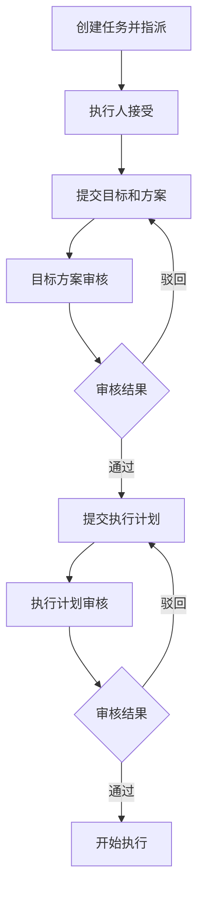

# 执行计划提交和审核功能

## 📋 功能概述

实现了执行计划的提交和审核功能，逻辑与目标方案审核完全一致。

## 🔄 完整流程

```
目标方案审核通过 → req_pending_plan → 提交执行计划 → 
自动发起单人审核 → 创建人审核 → 审核通过 → req_in_progress
```

## ✨ 核心功能

### 1. 提交执行计划

**接口：** `POST /api/v1/tasks/:id/execution-plan`

**说明：** 执行人提交需求任务的执行计划

**适用状态：**
- `req_pending_plan` - 目标方案审核通过后
- `req_plan_rejected` - 执行计划被驳回后重新提交

**请求体：**
```json
{
  "tech_stack": "React + Node.js + PostgreSQL",
  "implementation_steps": {
    "step1": {
      "title": "前端开发",
      "tasks": ["设计UI", "实现组件", "集成API"],
      "duration": "5天"
    },
    "step2": {
      "title": "后端开发",
      "tasks": ["设计数据库", "实现API", "编写测试"],
      "duration": "7天"
    }
  },
  "resource_requirements": "2名前端工程师，1名后端工程师",
  "risk_assessment": "技术风险较低，主要风险在于时间评估可能不准确"
}
```

**字段说明：**
- `tech_stack`: 技术栈说明（必填）
- `implementation_steps`: 实施步骤（JSON 格式，必填）
- `resource_requirements`: 资源需求说明
- `risk_assessment`: 风险评估说明

**响应：**
```json
{
  "code": 200,
  "message": "执行计划提交成功",
  "data": null
}
```

**自动触发：**
- 创建执行计划记录（版本号自动递增）
- 任务状态变更：`req_pending_plan` → `req_plan_review`
- 自动创建审核会话（单人模式）

### 2. 版本控制

**逻辑：**
- 查询 `execution_plans` 表中该任务的最大版本号
- 新版本号 = max_version + 1
- 保留所有历史版本

**示例：**
```sql
SELECT * FROM execution_plans WHERE task_id = 1;
-- 结果：
-- version 1: 首次提交（status: rejected）
-- version 2: 修改后重新提交（status: approved）
```

### 3. 审核流程

**审核类型：** `execution_plan_review`

**流程与目标方案审核完全一致：**
1. 提交计划后自动发起**单人审核**
2. 创建人可邀请**陪审团**参与
3. 陪审团成员提交意见
4. 创建人做出最终决策

**状态转换：**
- 审核通过：`req_plan_review` → `req_in_progress`
- 审核驳回：`req_plan_review` → `req_plan_rejected`

## 📊 审核类型汇总

| 审核类型 | 说明 | 审核对象 | 任务状态 |
|---------|------|---------|---------|
| `goal_solution_review` | 目标与方案审核 | `requirement_solutions` | `req_goal_review` |
| `execution_plan_review` | 执行计划审核 | `execution_plans` | `req_plan_review` |

**注意：** 用户修改了审核类型为 `goal_solution_review`（目标与方案一起审核）

## 💡 使用示例

### 完整流程示例

```bash
# 步骤1：提交目标和方案
POST /api/v1/tasks/1/goals
{
  "goals": [...],
  "solution": {...}
}
# 状态：req_goal_review
# 自动创建审核会话（goal_solution_review）

# 步骤2：创建人审核通过
POST /api/v1/review-sessions/1/finalize
{
  "approved": true,
  "comment": "目标和方案合理，通过"
}
# 状态：req_pending_plan

# 步骤3：提交执行计划
POST /api/v1/tasks/1/execution-plan
{
  "tech_stack": "...",
  "implementation_steps": {...},
  "resource_requirements": "...",
  "risk_assessment": "..."
}
# 状态：req_plan_review
# 自动创建审核会话（execution_plan_review）

# 步骤4：创建人审核通过
POST /api/v1/review-sessions/2/finalize
{
  "approved": true,
  "comment": "执行计划可行，通过"
}
# 状态：req_in_progress（开始执行）
```

### 驳回后重新提交

```bash
# 执行计划被驳回
POST /review-sessions/2/finalize
{ "approved": false, "comment": "技术栈需要调整" }
# 状态：req_plan_rejected

# 修改后重新提交（版本 v2）
POST /tasks/1/execution-plan
{
  "tech_stack": "Vue3 + Fastify + MySQL",  # 修改后
  "implementation_steps": {...}
}
# 状态：req_plan_review
```

## 🆕 新增/更新内容

### Service 层
- ✅ `SubmitExecutionPlan` - 提交执行计划（支持版本控制）
- ✅ 更新 `FinalizeReview` - 支持 `execution_plan_review`
- ✅ 更新 `InitiateReview` - 支持 `execution_plan_review`

### DTO 层
- ✅ `SubmitExecutionPlanRequest` - 执行计划提交请求

### Controller 层
- ✅ `SubmitExecutionPlan` - 提交执行计划接口

### 路由
- ✅ `POST /api/v1/tasks/:id/execution-plan` - 提交执行计划

## 📈 完整任务流程



## ✅ 验证结果

- ✅ 代码编译通过
- ✅ 版本控制正确
- ✅ 审核类型支持完整
- ✅ Swagger 文档已更新

## 🎯 关键特性

1. **版本控制**：支持多次修改和重新提交
2. **自动审核**：提交后自动发起单人审核
3. **灵活审核**：可邀请陪审团参与
4. **完整流程**：从目标到计划到执行的完整链路

**执行计划审核功能已完成，与目标方案审核逻辑完全一致！**
