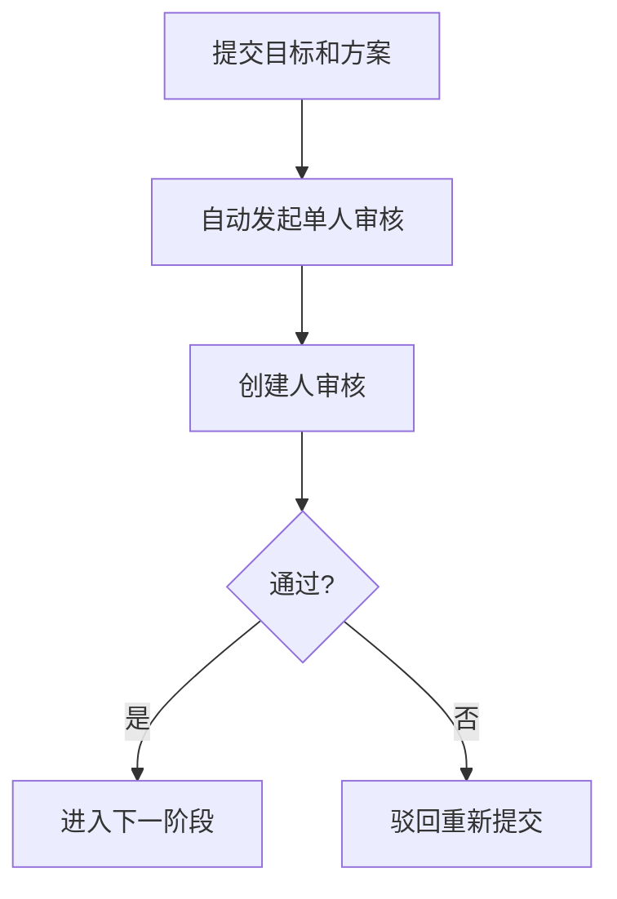
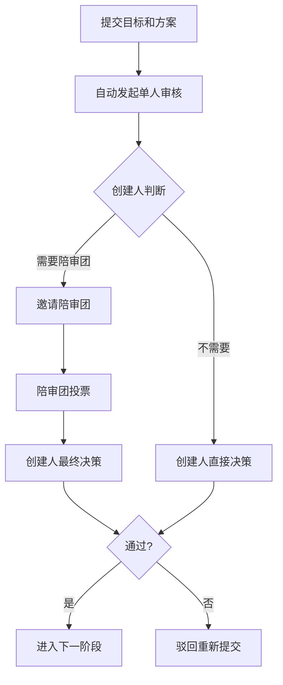

# 审核流程调整说明

## 📋 调整概述

根据您的反馈，已优化审核流程，使其更加自动化和灵活。

## 🔄 主要变更

### 变更1：提交目标/方案后自动发起审核

**之前的流程：**
```
提交目标和方案 → 手动调用发起审核接口 → 开始审核
```

**现在的流程：**
```
提交目标和方案 → 自动发起单人审核 → 创建人审核
```

**优势：**
- ✅ 减少一次API调用
- ✅ 流程更自然，无需手动触发
- ✅ 默认单人审核，效率更高

### 变更2：支持动态邀请陪审团

**之前：**
- 发起审核时必须决定是单人还是陪审团模式
- 一旦确定无法更改

**现在：**
- 提交目标/方案后自动以**单人模式**发起审核
- 创建人审核时，如需要陪审团意见，可随时**邀请陪审团**
- 审核会话自动从 `single` 模式转为 `jury` 模式

**优势：**
- ✅ 更灵活的决策流程
- ✅ 创建人可根据实际情况决定是否需要陪审团
- ✅ 避免不必要的陪审团审核

## 🆕 新增功能

### 邀请陪审团接口

**接口：** `POST /api/v1/review-sessions/:sessionId/invite-jury`

**说明：** 创建人将单人审核转为陪审团审核

**权限：** 任务创建人

**请求体：**
```json
{
  "jury_member_ids": [5, 7, 9],
  "required_approvals": 2
}
```

**字段说明：**
- `jury_member_ids`: 陪审团成员用户ID列表
- `required_approvals`: 需要的通过票数

**响应：**
```json
{
  "code": 200,
  "message": "陪审团邀请成功",
  "data": null
}
```

**效果：**
- 审核会话的 `review_mode` 从 `single` 变为 `jury`
- 为每个陪审团成员创建 `task_participants` 记录（role=jury）
- 陪审团成员可提交审核意见
- 创建人综合考虑后做出最终决策

## 📊 新的审核流程对比

### 单人审核流程（默认）



### 陪审团审核流程（按需）



## 💡 使用场景示例

### 场景1：简单需求（单人审核）

```bash
# 步骤1：执行人提交目标和方案
POST /api/v1/tasks/1/goals
{
  "goals": [...],
  "solution": {...}
}
# 自动创建审核会话（单人模式）

# 步骤2：创建人直接审核决策
POST /api/v1/review-sessions/1/finalize
{
  "approved": true,
  "comment": "方案可行，通过"
}
```

### 场景2：复杂需求（需要陪审团）

```bash
# 步骤1：执行人提交目标和方案
POST /api/v1/tasks/1/goals
{
  "goals": [...],
  "solution": {...}
}
# 自动创建审核会话（单人模式）

# 步骤2：创建人邀请陪审团
POST /api/v1/review-sessions/1/invite-jury
{
  "jury_member_ids": [5, 7, 9],
  "required_approvals": 2
}
# 审核会话转为陪审团模式

# 步骤3：陪审团成员投票
POST /api/v1/review-sessions/1/opinion
{ "opinion": "approve", "comment": "技术方案合理" }

# 步骤4：创建人综合陪审团意见，做最终决策
POST /api/v1/review-sessions/1/finalize
{
  "approved": true,
  "comment": "综合陪审团意见，方案通过"
}
```

## 🔧 代码变更详情

### 1. TaskFlowService.SubmitGoalsAndSolution

**新增逻辑：**
```go
// 提交方案后，自动创建审核会话
reviewSession := &models.ReviewSession{
    TaskID:            taskID,
    ReviewType:        "goal_review",
    TargetType:        "requirement_solutions",
    TargetID:          solution.ID,
    InitiatedBy:       userID,
    InitiatedAt:       now,
    Status:            "in_review",
    ReviewMode:        "single",  // 默认单人模式
    RequiredApprovals: 1,
}
```

### 2. TaskFlowService.InviteJuryMembers（新增方法）

**功能：** 将单人审核转为陪审团审核

**关键逻辑：**
- 验证创建人权限
- 检查审核会话状态必须为 `in_review`
- 更新 `review_mode` 为 `jury`
- 创建陪审团成员的 `task_participants` 记录

## 📝 API 接口汇总

| 方法 | 路径 | 变更 | 说明 |
|------|------|------|------|
| POST | `/api/v1/tasks/:id/goals` | **已优化** | 提交后自动发起单人审核 |
| POST | `/api/v1/tasks/:id/review` | 保留 | 仍可独立发起审核（执行计划等） |
| POST | `/api/v1/review-sessions/:sessionId/invite-jury` | **新增** | 邀请陪审团（单人转陪审团） |
| POST | `/api/v1/review-sessions/:sessionId/opinion` | 不变 | 陪审团成员提交意见 |
| POST | `/api/v1/review-sessions/:sessionId/finalize` | 不变 | 创建人最终决策 |

## ✅ 验证结果

- ✅ 代码编译通过
- ✅ Swagger 文档已更新
- ✅ 所有接口路由已配置

## 🎯 后续建议

如果需要对执行计划审核也应用相同的流程，可以：
1. 创建 `SubmitExecutionPlan` 方法
2. 提交计划后自动发起单人审核
3. 同样支持邀请陪审团

这样可以保持整个审核流程的一致性。
