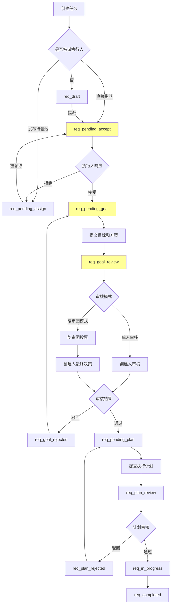
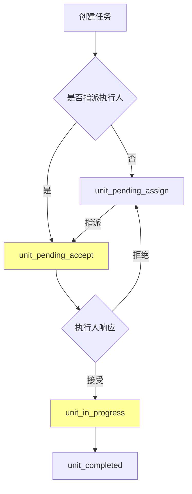

# 任务状态分析与调整建议

## 现有状态对比分析

### ✅ 需求任务状态（已有）

| 序号 | 状态码 | 名称 | 说明 | 是否匹配需求 |
|------|--------|------|------|-------------|
| 1 | `req_draft` | 草稿 | 未指派执行人 | ✅ 完全匹配 |
| 2 | `req_pending_assign` | 待指派 | 发布到待领池 | ✅ 支持待领池场景 |
| 3 | `req_pending_accept` | 待接受 | 已指派，等待确认 | ✅ **核心状态** |
| 4 | `req_pending_goal` | 待提交目标 | 执行人已接受，需提交目标 | ✅ **核心状态** |
| 5 | `req_goal_review` | 目标审核中 | 目标和方案审核中 | ✅ **核心状态** |
| 6 | `req_goal_rejected` | 目标被驳回 | 目标和方案被驳回 | ✅ 支持驳回流程 |
| 7 | `req_pending_plan` | 待提交计划 | 目标通过，需提交执行计划 | ✅ 后续阶段 |
| 8 | `req_plan_review` | 计划审核中 | 执行计划审核中 | ✅ 后续阶段 |
| 9 | `req_plan_rejected` | 计划被驳回 | 执行计划被驳回 | ✅ 后续阶段 |
| 10 | `req_in_progress` | 执行中 | 子任务执行中 | ✅ 完全匹配 |
| 11 | `req_completed` | 已完成 | 需求任务已完成 | ✅ 终态 |
| 12 | `req_cancelled` | 已取消 | 需求任务已取消 | ✅ 终态 |
| 18 | `req_blocked` | 受阻 | 需求任务执行受阻 | ✅ 异常状态 |

### ✅ 最小任务单元状态（已有）

| 序号 | 状态码 | 名称 | 说明 | 是否匹配需求 |
|------|--------|------|------|-------------|
| 13 | `unit_draft` | 草稿 | 单元任务草稿状态 | ✅ 完全匹配 |
| 14 | `unit_pending_accept` | 待接受 | 已指派，等待接受 | ✅ **核心状态** |
| 15 | `unit_in_progress` | 进行中 | 任务执行中 | ✅ 完全匹配 |
| 16 | `unit_completed` | 已完成 | 任务已完成 | ✅ 终态 |
| 17 | `unit_cancelled` | 已取消 | 任务已取消 | ✅ 终态 |
| 19 | `unit_blocked` | 受阻 | 单元任务执行受阻 | ✅ 异常状态 |

## 🔍 缺口分析

### 需要补充的状态

根据您的需求描述，建议补充以下状态：

#### 1. 最小任务单元缺少"待指派"状态

> [!IMPORTANT]
> 您的需求：*"最小任务类创建，状态为待接收，未指执行人时状态为待指派"*

**建议新增：**
```sql
INSERT INTO task_statuses (code, name, task_type_code, sort_order, description) VALUES
    ('unit_pending_assign', '待指派', 'unit_task', 1.5, '未指派执行人，等待分配')
ON CONFLICT (code) DO NOTHING;
```

**调整后的 unit_task 状态序列：**
- `unit_draft` (草稿) - 初始创建状态
- `unit_pending_assign` (待指派) - **新增**：未指派执行人
- `unit_pending_accept` (待接受) - 已指派，等待接受
- `unit_in_progress` (进行中)
- `unit_completed` / `unit_cancelled` / `unit_blocked`

#### 2. 执行人拒绝后的状态（可选）

当执行人拒绝任务时，有两种处理方式：

**方式A：回到原状态**
- 需求任务：`req_pending_accept` → 拒绝 → `req_pending_assign`（重新指派）
- 最小任务：`unit_pending_accept` → 拒绝 → `unit_pending_assign`（重新指派）

**方式B：新增拒绝状态（不推荐）**
- `req_rejected` - 需求任务被拒绝
- `unit_rejected` - 最小任务被拒绝

> [!NOTE]
> **建议：采用方式A**，拒绝后直接回到待指派状态，无需新增状态。拒绝原因记录在 `task_change_log` 或 `TaskParticipant.Status=rejected` 中。

## 完整流程图

### 需求任务完整流程



### 最小任务单元完整流程



## 状态转换矩阵

### 需求任务状态转换规则

| 当前状态 | 允许转换到 | 触发条件 | 操作权限 |
|---------|----------|---------|---------|
| `req_draft` | `req_pending_assign`<br>`req_pending_accept` | 发布到待领池<br>直接指派 | 创建人 |
| `req_pending_assign` | `req_pending_accept` | 执行人领取 | 任何人 |
| `req_pending_accept` | `req_pending_goal`<br>`req_pending_assign` | 执行人接受<br>执行人拒绝 | 执行人 |
| `req_pending_goal` | `req_goal_review` | 提交目标和方案 | 执行人 |
| `req_goal_review` | `req_pending_plan`<br>`req_goal_rejected` | 审核通过<br>审核驳回 | 创建人 |
| `req_goal_rejected` | `req_pending_goal` | 重新提交 | 执行人 |
| `req_pending_plan` | `req_plan_review` | 提交执行计划 | 执行人 |
| `req_plan_review` | `req_in_progress`<br>`req_plan_rejected` | 审核通过<br>审核驳回 | 创建人 |
| `req_plan_rejected` | `req_pending_plan` | 重新提交 | 执行人 |
| `req_in_progress` | `req_completed`<br>`req_blocked` | 完成<br>受阻 | 执行人 |

### 最小任务单元状态转换规则

| 当前状态 | 允许转换到 | 触发条件 | 操作权限 |
|---------|----------|---------|---------|
| `unit_draft` | `unit_pending_assign`<br>`unit_pending_accept` | 发布<br>直接指派 | 创建人 |
| `unit_pending_assign` | `unit_pending_accept` | 指派执行人 | 创建人/管理员 |
| `unit_pending_accept` | `unit_in_progress`<br>`unit_pending_assign` | 执行人接受<br>执行人拒绝 | 执行人 |
| `unit_in_progress` | `unit_completed`<br>`unit_blocked` | 完成<br>受阻 | 执行人 |

## 实现调整建议

### 1. CreateTask 逻辑调整

```go
// 伪代码
func CreateTask(req *TaskRequest, creatorID uint) {
    var statusCode string
    
    switch req.TaskTypeCode {
    case "requirement":
        if req.ExecutorID != nil {
            statusCode = "req_pending_accept"  // 直接指派
        } else if req.IsInPool {
            statusCode = "req_pending_assign"  // 发布到待领池
        } else {
            statusCode = "req_draft"           // 草稿
        }
        
    case "unit_task":
        if req.ExecutorID != nil {
            statusCode = "unit_pending_accept" // 直接指派
        } else {
            statusCode = "unit_pending_assign" // 待指派
        }
    }
    
    task := &Task{
        StatusCode: statusCode,
        // ... 其他字段
    }
    
    // 如果指派了执行人，创建 TaskParticipant 记录
    if req.ExecutorID != nil {
        CreateTaskParticipant(task.ID, *req.ExecutorID, "executor", "pending")
    }
}
```

### 2. 核心方法实现优先级

**第一阶段（本次实现）：**
1. ✅ `AcceptTask` - 接受任务
2. ✅ `RejectTask` - 拒绝任务
3. ✅ `SubmitGoalsAndSolution` - 提交目标和方案
4. ✅ `InitiateReview` - 发起审核（目标审核）
5. ✅ `SubmitReviewOpinion` - 提交审核意见（陪审团）
6. ✅ `FinalizeReview` - 最终决策

**第二阶段（后续）：**
- `SubmitExecutionPlan` - 提交执行计划
- 执行计划审核流程

## 总结

> [!NOTE]
> **您现有的状态设计已经非常完善！**
> 
> **唯一需要补充的：**
> - 新增 `unit_pending_assign` 状态，用于最小任务单元"未指派执行人"的场景
> 
> **无需新增的：**
> - 不需要单独的"拒绝"状态，拒绝后回到待指派状态即可
> - 拒绝原因记录在 `task_change_log` 或 `TaskParticipant` 表中

**建议直接开始实现，状态定义已经可以支持您描述的完整流程！**
